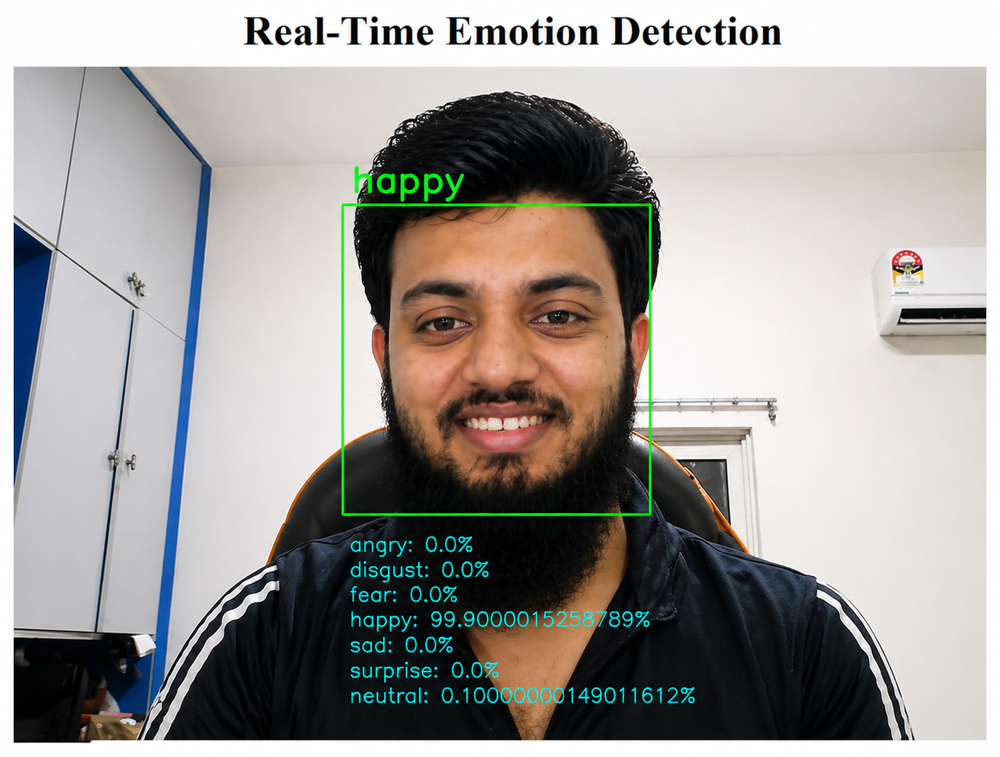

#  Real-Time Emotion Detection System

##  Author

**MD AL EMRAN**
 [alimarn.068@gmail.com](mailto:alimarn.068@gmail.com)

---

## 📌 Project Overview

This project is a **Real-Time Emotion Detection System** that uses a webcam to capture live video and detect human emotions using **Deep Learning**.

It identifies facial expressions such as:

*  Happy
*  Sad
*  Angry
*  Fear
*  Surprise
*  Disgust
*  Neutral

The system is built using **Python, OpenCV, DeepFace, and Flask** and displays results in real-time through a web interface.

---

##  Technologies Used

* Python
* OpenCV
* DeepFace
* Flask
* NumPy

---

##  How It Works

1. Captures live video using webcam
2. Detects face using Haar Cascade
3. Crops face region for better accuracy
4. Uses DeepFace model to analyze emotions
5. Displays dominant emotion and confidence scores

---

##  System Architecture

Camera → Frame Capture → Face Detection → Face Cropping → Emotion Analysis → Output Display

---

##  Features

* Real-time emotion detection
* Face-based preprocessing (improved accuracy)
* Displays all emotions with confidence %
* Smooth and stable predictions
* Web-based interface using Flask

---

##  Output Example

* Dominant Emotion: **Happy (99%)**
* Other emotions shown with confidence scores

---

##  Installation & Setup

### 1️⃣ Clone Repository

```bash
git clone https://github.com/YOUR_USERNAME/emotion-detection.git
cd emotion-detection
```

### 2️⃣ Install Dependencies

```bash
pip install flask opencv-python deepface tf-keras numpy
```

### 3️⃣ Run the Project

```bash
python app.py
```

### 4️⃣ Open in Browser

```
http://127.0.0.1:5000
```

---

##  Limitations

* Cannot detect complex emotions like confusion
* Accuracy depends on lighting and camera quality
* Requires proper face alignment

---

##  Future Scope

* Add more emotions using custom datasets
* Improve accuracy with advanced models
* Mobile app integration
* Emotion analytics dashboard

---

##  License

This project is for academic and learning purposes.

---

## Acknowledgment

* DeepFace Library
* OpenCV
* Flask Framework

---

##  Final Note

This project demonstrates the practical use of **AI + Computer Vision** in real-time human emotion analysis.

output example
## 📸 Output Screenshot


